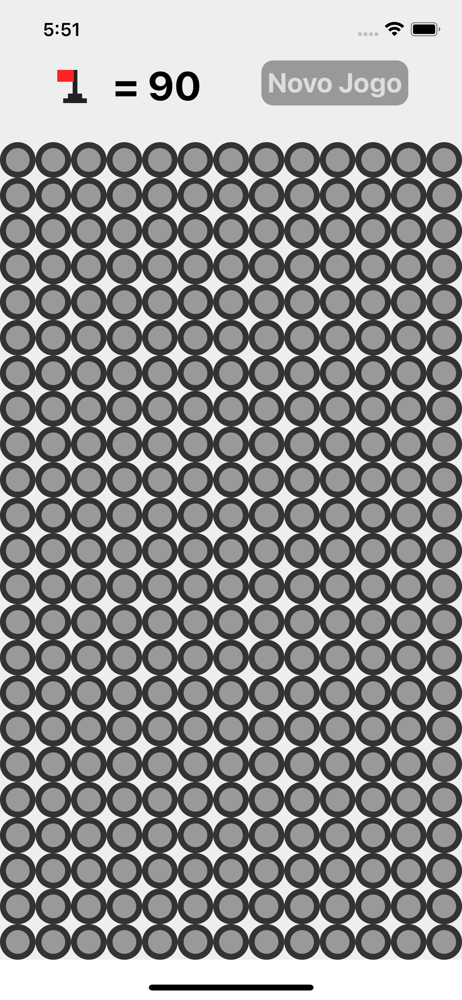

<h1 align="center">
    
</h1>

<br>

## 🧪 Tecnologias

Esse projeto foi desenvolvido com as seguintes tecnologias:

- [React Native](https://reactnative.dev/)
- [JavaScript](https://www.javascript.com/)

## 🚀 Como executar

Clone o projeto e acesse a pasta do mesmo.

```bash
$ git clone https://github.com/victorb132/mines.git
$ cd calculator
```

Para iniciá-lo, siga os passos abaixo:
```bash
# Instalar as dependências
$ yarn

# Instalar as dependências do ios
$ cd ios

# Iniciar o projeto
$ yarn ios
  ou
$ yarn android
```

## 💻 Projeto

Calculator é um projeto de calculador básica. 

Este é um projeto desenvolvido no inicio da minha vida como programador de react native.

---

Feito com 💜 by Victor Novais
